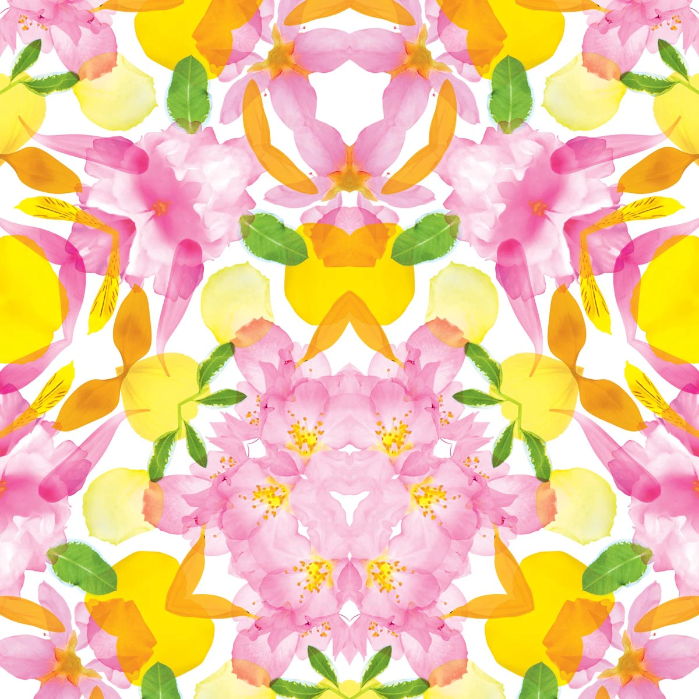

# Week8Quiz_9103_tut4

_**Part 1: Imaging Technique Inspiration**_

As our group chose to emulate the _Wheel of Fortune_, I was inspired by a group of flower-printed artworks from Japan. They remind me of the technique of a kaleidoscope. There are some similarities between these two works, as both use patterns to decorate around centers to complete the images. They also use petals to simulate lines and ellipses. I wanted to learn how to construct patterns like these because they have an overall sense of harmony and regularity that isn't overpowering, even though the size and color change dynamically.

_**Part 2: Coding Technique Exploration**_

The original painting features many colorful circles with different patterns. I found a set of code on the internet that shows regular shapes radiating outward from a center, which is similar to my inspiration from Part 1. Using the function ffl(x, y, d, ang, n) generates a polygon with a specified number of sides, rotation angle, and size. The polygon is dynamically created based on these parameters. The functions push() and pop() are used to save and restore the current drawing style settings and transformations. Then, the function vertex() adjusts the radius and creates vertices to form a star-like shape.
[Example Code Link](https://openprocessing.org/sketch/2150902)

